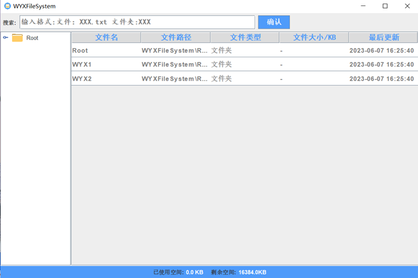
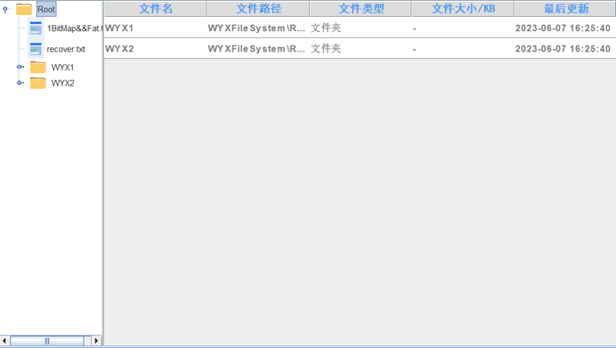
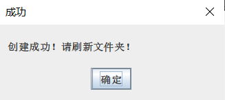
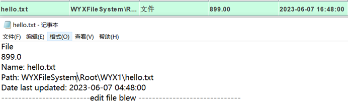

# 操作系统文件管理项目文档

## 一、 项目简介

本项目旨在创建一个简单而可靠的文件管理系统，以满足基本的文件存储、管理和操作需求。通过在内存中开辟文件存储空间并采用链接结构（如FAT文件系统中的显式链接）进行管理，实现对文件的高效访问和组织。

项目涵盖了空闲空间管理、多级目录结构、文件系统的格式化功能，以及提供创建、打开、关闭、读写和删除文件等常见操作。用户可以轻松创建子目录、删除不需要的子目录、显示目录结构并更改当前目录，为文件的组织和管理提供便利。

此外，文件系统的内容会定期保存到磁盘上，以确保数据的持久性和安全性。该文件管理项目为用户提供了一个基础的文件管理工具，满足日常文件处理和组织的基本要求。

 ##  **二、**技术栈

* 编程语言：Java

* 开发工具：IntelliJ IDEA Community Edition 2023.1.2

* GUI库：javax.swing.

* AWT库：java.awt.

## 三、界面设计

****

本操作系统文件管理项目的UI界面如图，分为如下几个部分：文件搜索区、文件目录区、文件详细信息区、系统状态区。

文件搜索区包括：

* 搜索框。当其失去焦点时，会显示输入提示信息。当其获得焦点时，可以按要求输入文件名来搜索。

* 搜索确认按钮：单击确认按钮提交对应输入的文件名来打开文件。

文件目录区包括：

* 根目录Root文件夹。

* 默认生成的WYX1和WYX2文件夹。

* 后续添加的各类文件夹和文件。

文件详细信息区包括：

* 标题栏：文件所具有的属性种类。

* 文件信息表。可以查看文件具体信息或者单击打开指定文件。

系统状态区包括：

* 已使用空间、剩余空间。便于查看系统空间使用情况。

## **四、** **功能设计**

本项目主要设计并实现了以下一些功能：

1.文件树展示和文件表格显示：

* 使用JTree组件和DefaultMutableTreeNode类实现文件树的展示，文件树中的节点对应文件系统中的文件夹和文件。

* 使用JTable组件和TableModel实现文件表格的显示，文件表格中的每一行对应文件系统中的文件。

2.新建文件夹和文件：

通过右键菜单，实现新建文件夹和文件的功能。

* 新建文件夹：使用JOptionPane.showInputDialog方法获取用户输入的文件夹名称，然后通过File类创建新的文件夹。

* 新建文件：使用JOptionPane.showInputDialog方法获取用户输入的文件名称和大小，然后通过File类创建新的文件。

 

 

3.文件的打开和删除：

* 文件的打开：双击文件表格中的文件行，通过Desktop类的open方法实现文件的打开。

* 文件的删除：使用递归方法deleteDirectory删除文件夹及其下的所有文件和子文件夹。

4.文件搜索：

通过递归方法searchFile实现文件的搜索功能，搜索文件在文件系统中的路径，如果找到文件，则通过Desktop类的open方法打开文件。

5.文件夹空间统计：

* 通过upDateBlock方法更新文件夹的信息，包括已使用空间和剩余空间。

* 使用getSpace方法获取文件的空间大小。

6.格式化：

* 当用户选择该功能时，首先获取当前选中的树节点（DefaultMutableTreeNode）和对应的WYXFile对象（代表文件或文件夹）。

* 通过WYXFile对象获取文件所在的块名（blockName），然后从列表（folders）中获取对应的Folder对象（代表文件夹块）。

* 在弹出的确认对话框中，用户可以选择是否要格式化文件夹。如果用户选择是，执行以下步骤：检查块名是否为1，如果是，表示没有权限对其进行格式化，弹出错误提示框并结束操作。

* 如果文件是文件夹（isDirectory），遍历文件夹中的每个文件，逐个从当前块（currentBlock）中删除文件，并释放文件占用的空间。

* 更新当前块的状态，包括重新计算空闲空间和重新生成位图。

* 弹出成功提示框，要求用户刷新文件夹。

如果发生异常（例如文件删除失败），则弹出错误提示框。

 

7.重命名：

* 当用户选择该功能时，首先获取当前选中的树节点（DefaultMutableTreeNode）和对应的WYXFile对象（代表文件或文件夹）。

* 通过WYXFile对象获取文件所在的块名（blockName），然后从列表（folders）中获取对应的Folder对象（代表文件夹块）。检查块名是否为1，如果是，表示没有权限对其进行重命名，弹出错误提示框并结束操作。

* 弹出输入对话框，要求用户输入新的文件名。如果用户取消输入（点击取消按钮），则结束操作。如果用户输入了新的文件名，将其作为参数调用当前块（currentBlock）的renameFile方法，传递要重命名的文件、新文件名和文件占用的空间。

* 如果重命名成功，弹出成功提示框，要求用户刷新文件夹。如果发生异常（例如重命名失败），则弹出错误提示框。

 ## **五、类设计**

本项目中共涉及四个类，WYXFileSystem类，documentTable类，Folder类和WYXFile类。

1.WYXFileSystem类是一个文件系统的实现，提供了管理文件和文件夹的功能。它的主要作用是模拟文件系统的层级结构和文件操作，包括创建、删除、格式化、重命名等操作。

该类的设计采用了树形结构表示文件系统，其中树的节点是DefaultMutableTreeNode对象，每个节点代表一个文件或文件夹。每个节点都包含一个WYXFile对象，该对象包含了文件或文件夹的属性和操作。

文件系统通过一个文件夹块列表（folders）来管理文件和文件夹的存储。每个文件夹块都是Folder对象，包含了文件夹的名称、子文件夹和文件列表、空闲空间等信息。文件的内容并没有在这个类中实际存储，而是通过文件路径和文件的占用空间来管理。

WYXFileSystem类提供了一系列方法来实现文件系统的各种功能。例如，可以通过方法创建文件或文件夹、删除文件或文件夹、格式化文件夹、重命名文件等。这些方法内部会更新文件夹块的状态，并根据需要进行文件的创建、删除和重命名操作。

此外，WYXFileSystem类还提供了一些辅助方法，用于计算文件夹块的空闲空间、更新位图等。它还包含了与用户交互的部分，如弹出对话框进行确认、输入新文件名等

2.documentTable类是一个自定义的TableModel，用于在Swing应用程序中展示文件信息的表格。它继承自AbstractTableModel类，并实现了TableModel接口的相关方法。

该类的设计旨在提供一个数据模型，用于存储和管理文件信息，并将其呈现在表格中。它包含一个内容向量（content）和一个标题名称数组（title_name），用于存储文件的相关属性和表格的列名。

该类提供了一些方法来操作数据模型，例如添加文件行、删除文件行等。通过调用addRow方法，可以向数据模型中添加一个WYXFile对象，然后将其转换为向量，并添加到内容向量中。在添加行时，还会根据文件的类型和大小格式化数据，并获取文件的最后更新时间。

在添加行之前，还提供了shouldShowFile方法来过滤不需要显示的文件。根据特定条件，如文件名是否为"BitMap&&Fat.txt"或"recover.txt"，决定是否应该显示该文件。

另外，该类还实现了TableModel接口的方法，如setValueAt、getColumnName、isCellEditable、getRowCount、getColumnCount和getValueAt等。这些方法用于处理表格的编辑、列名、可编辑性以及获取行数和列数等。

3.Folder类是一个用于管理文件夹和文件的Java类，它提供了添加、删除和重命名文件等功能，并跟踪文件的存储状态和占用空间。通过位图和文件控制块，它能够管理文件夹中的文件，并提供对文件夹属性和状态的访问方法。该类的设计目的是提供一个可靠的文件管理系统，方便对文件进行操作和跟踪。

4.WYXFile类是一个表示文件的Java类，它封装了文件的属性和操作方法。该类通过包含一个File对象来表示实际的文件，并提供了获取文件名、文件路径和文件大小的方法。它还支持重命名文件，并通过记录块名和容量来跟踪文件的存储信息。该类的设计目的是为了提供对文件的基本操作和信息访问，方便文件管理和操作。它还重写了toString方法，以便在需要时以文件名的形式进行展示和使用。

## **六、项目总结**

  该操作系统文件管理系统项目实现了一个较为可靠且完整的文件管理系统。该系统能够较好地实现文件管理任务，具有健全的功能和灵活性，满足了用户需求。同时系统使用位图来跟踪文件的存储状态，有效地管理文件的存储空间，提高了存储效率。系统具有较好地可视化界面，能够帮助用户直观地了解到文件之间的关系以及进行所需要的操作。通过这次项目，我也对文件系统有了更深的了解，进一步复习巩固了相关知识。

 

 